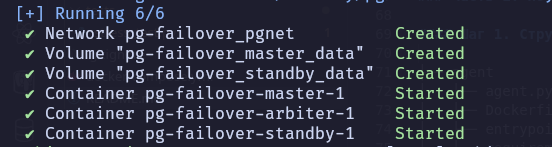
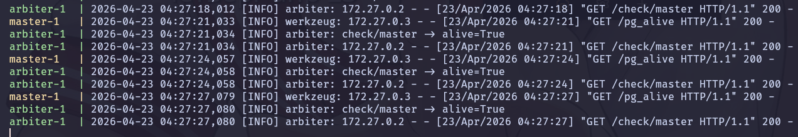
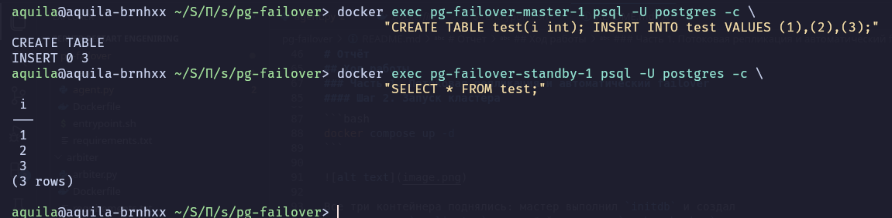
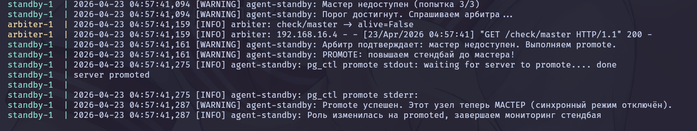
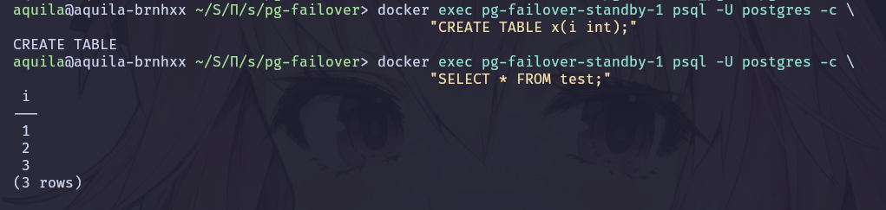
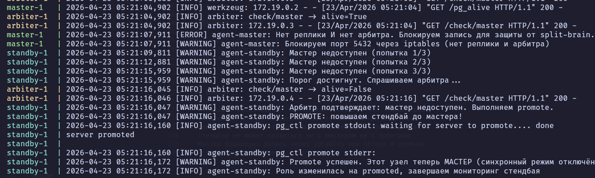
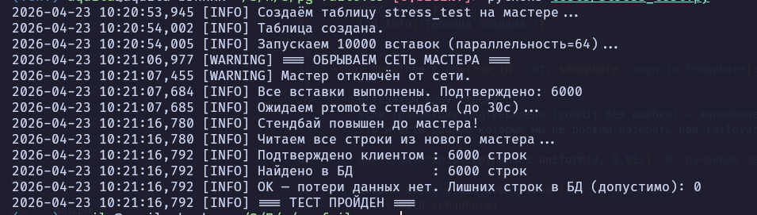
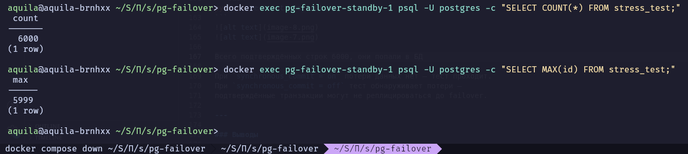

# Отчёт

Лабораторная работа №2 — Практическое изучение отказоустойчивости.  
Группа: РИ-421050
Выполнили: Ильиных К.Д. Мелехин К.О. Тартышных Д.К. 


## Что это

Отказоустойчивый кластер PostgreSQL 17 с автоматическим failover.  
Агент на каждом узле следит за состоянием кластера и координируется  
с арбитром для принятия решения о promote стендбая.

## Архитектура

[Мастер (M)] <-- потоковая репликация --> [Реплика (S)]
      |                                      |
      +----------> [Арбитр (A)] <-----------+


## Ход работы

### Часть 1. Потоковая репликация и автоматический failover

#### Шаг 1. Структура проекта
 .
├── agent
│   ├── agent.py
│   ├── Dockerfile
│   ├── entrypoint.sh
│   └── requirements.txt
├── arbiter
│   ├── arbiter.py
│   ├── Dockerfile
│   └── requirements.txt
├── docker-compose.yml
├── README.md
└── tests
    └── stress_test.py

#### Шаг 2. Запуск кластера

```bash
docker compose up -d
```



Все три контейнера поднялись: мастер выполнил `initdb` и создал
пользователя `replicator`, стендбай выполнил `pg_basebackup` и
подключился как реплика, арбитр запустил HTTP-сервис.

#### Шаг 3. Проверка репликации

Создаём таблицу на мастере и читаем её со стендбая:

```bash
docker exec pg-failover-master-1 psql -U postgres -c \
  "CREATE TABLE test(i int); INSERT INTO test VALUES (1),(2),(3);"

docker exec pg-failover-standby-1 psql -U postgres -c \
  "SELECT * FROM test;"
```



Данные появились на стендбае — потоковая репликация работает.

#### Шаг 4. Тест failover — обрыв сети мастера

```bash
docker network disconnect pg-failover_pgnet pg-failover-master-1
```

Агент на стендбае зафиксировал потерю связи с мастером,
запросил подтверждение у арбитра и выполнил promote:



#### Шаг 5. Проверка нового мастера

После promote бывший стендбай принимает запись:

```bash
docker exec pg-failover-standby-1 psql -U postgres -c \
  "CREATE TABLE x(i int);"
```


Данные из таблицы `test` также сохранились:

```bash
docker exec pg-failover-standby-1 psql -U postgres -c \
  "SELECT * FROM test;"
```



---

### Часть 2. Верификация отказоустойчивости

Стресс-тест проверяет утверждение:
> «Результат запроса, получившего подтверждение фиксации транзакции,
> не будет потерян»

Алгоритм теста (`tests/stress_test.py`):
1. Создаётся чистая таблица на мастере
2. Запускается 10 тысяч асинхронных INSERT со случайной задержкой
3. Каждый подтверждённый INSERT записывается в память тестирующей системы
4. На середине теста обрывается сеть мастера
5. Ожидается promote стендбая
6. Все строки читаются из нового мастера
7. Проверяется: каждая подтверждённая строка должна быть в БД

```bash
python3 tests/stress_test.py
```



Всего подтверждённых строк 6000, они попали в БД


При `synchronous_commit = on` потери данных нет — тест проходит.
При `synchronous_commit = off` тест обнаруживает потери —
подтверждённые транзакции могут не реплицироваться до failover.

---

### Выводы

- Потоковая репликация с `synchronous_commit = on` гарантирует
  отсутствие потери подтверждённых транзакций при failover
- Арбитр предотвращает split-brain: promote не происходит если
  стендбай не может связаться ни с мастером ни с арбитром
- Мастер блокирует запись через iptables при потере и реплики
  и арбитра одновременно


  -----------------------------------
  # pg-failover

## Описание

Кластер высокой доступности PostgreSQL с автоматическим переключением (failover) через координацию агентов.

## Топология
[Мастер (M)] <-- потоковая репликация --> [Реплика (S)]
      |                                      |
      +----------> [Арбитр (A)] <-----------+

## Компоненты

- **Мастер (Master)** — основной узел PostgreSQL.  
- **Реплика (Standby)** — потоковая реплика с `synchronous_commit=on`.  
- **Арбитр (Arbiter)** — лёгкий HTTP‑сервис без PostgreSQL, служит только для проверки доступности узлов.

## Логика переключения (failover)

- Если **S** теряет связь с **M**, он спрашивает у **A**: «а ты видишь **M**?»  
  - **A** отвечает **NO** → **S** повышается до мастера.  
  - **A** отвечает **YES** → **S** ждёт (мастер жив, проблема в сети рядом с **S**).  
- Если **S** теряет связь и с **M**, и с **A** → **S** не повышается (предотвращение split‑brain).  
- Если **M** теряет реплику и теряет связь с **A** → запись на **M** блокируется правилами `iptables`.

## Использование

```bash
docker compose up -d

# запустить нагрузочный тест
docker compose exec master pgbench -i -U postgres postgres
docker compose exec master pgbench -U postgres -T 60 -c 10 --host=master,standby postgres

# имитировать падение мастера
docker network disconnect pg-failover_pgnet pg-failover-master-1
```

## Часть 2 — нагрузочный тест

```bash
python tests/stress_test.py
```